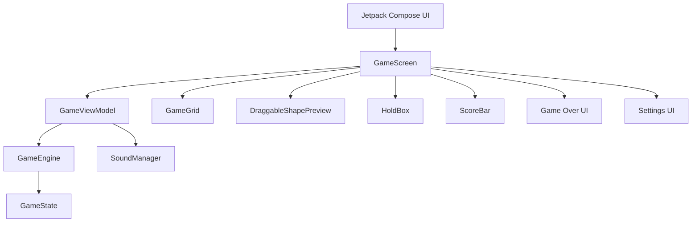

<div align="center">

# PuzzleNest

<p><b>A modern Android block puzzle game built with Kotlin and Jetpack Compose, featuring drag & drop gameplay, rotation, hold mechanics, scoring, sound effects and a premium Liquid Glass interface.</b></p>

<p>Android Application · Kotlin · Jetpack Compose · Material 3 · Canvas</p>

<br>


<br><br>

<table align="center" width="85%">
  <tr>
    <td align="center">
      <h2>PuzzleNest</h2>
      <p>
        A modern block puzzle game combining simple puzzle mechanics,<br>
        smooth interactions, responsive gameplay and a premium glass-inspired interface.
      </p>
    </td>
  </tr>
</table>

<br>

<sub><em>PuzzleNest is an Android block puzzle game focused on clean gameplay, responsive interactions, visual polish and lightweight performance.</em></sub>

</div>

---

## 📑 Table of Contents

<table width="100%">
<tr>

<td valign="top">

1. <a href="#1-overview">Overview</a><br>
2. <a href="#2-gameplay">Gameplay</a><br>
3. <a href="#3-key-features">Key Features</a><br>
4. <a href="#4-game-flow">Game Flow</a><br>
5. <a href="#5-architecture">Architecture</a><br>
6. <a href="#6-ui--design-system">UI & Design System</a>

</td>

<td valign="top">

7. <a href="#7-performance">Performance</a><br>
8. <a href="#8-sound-system">Sound System</a><br>
9. <a href="#9-project-structure">Project Structure</a><br>
10. <a href="#10-quick-start">Quick Start</a><br>
11. <a href="#11-build">Build</a><br>
12. <a href="#12-technical-stack">Technical Stack</a>

</td>

<td valign="top">

13. <a href="#13-game-rules">Game Rules</a><br>
14. <a href="#14-future-enhancements">Future Enhancements</a><br>
15. <a href="#15-author">Author</a><br>
16. <a href="#16-assessment-context">Assessment Context</a>

</td>

</tr>
</table>

---

## 1. Overview

PuzzleNest is a modern Android block puzzle game inspired by classic 1010-style puzzle mechanics.

The game provides a simple but engaging gameplay loop where players place randomly generated pieces on an 8×8 grid, clear completed rows and columns, earn points and continue playing until no available piece can be placed.

The application focuses on:

- **✓** 8×8 puzzle board
- **✓** Drag & drop piece placement
- **✓** Ghost piece preview
- **✓** Piece rotation
- **✓** Hold mechanic
- **✓** Score tracking
- **✓** Best score tracking
- **✓** Row and column clearing
- **✓** Score pop animations
- **✓** Refresh mechanic
- **✓** Game-over detection
- **✓** Game-over warning state
- **✓** Haptic feedback
- **✓** Gameplay sound effects
- **✓** Multiple color palettes
- **✓** Premium Liquid Glass inspired UI
- **✓** Responsive Android layout

**Core idea:**

```text
GENERATE
    ↓
DRAG
    ↓
PLACE
    ↓
CLEAR
    ↓
SCORE
    ↓
CONTINUE
```

---

## 2. Gameplay

PuzzleNest uses an 8×8 board where players place different block shapes generated in the game tray.

Three pieces are available at a time.

Players can:

- Drag a piece onto the board
- Preview its placement using a ghost shape
- Rotate pieces
- Store a piece using the Hold box
- Clear completed rows
- Clear completed columns
- Earn points from successful placements and clears
- Refresh available pieces when enough points are available

The game continues as long as at least one available piece can be legally placed on the board.

---

## 3. Key Features

<table width="100%">
<tr>

<td width="50%" valign="top">

<b>8×8 Puzzle Board</b><br>
A compact grid-based board designed for fast and strategic gameplay.

<br><br>

<b>Drag & Drop</b><br>
Pieces can be dragged directly from the tray onto the puzzle board.

<br><br>

<b>Ghost Preview</b><br>
The game displays a placement preview before the piece is released.

<br><br>

<b>Piece Rotation</b><br>
Pieces can be rotated through the in-game rotation interaction.

<br><br>

<b>Hold Mechanic</b><br>
Players can temporarily store a piece and use it later.

<br><br>

<b>Line Clearing</b><br>
Completed rows and columns are automatically detected and cleared.

</td>

<td width="50%" valign="top">

<b>Score System</b><br>
Players receive points for successful placements and completed lines.

<br><br>

<b>Refresh Mechanic</b><br>
Players can refresh the available pieces using the in-game point cost.

<br><br>

<b>Game Over Detection</b><br>
The game detects when none of the available pieces can be placed.

<br><br>

<b>Sound Effects</b><br>
Native Android SoundPool is used for lightweight gameplay feedback.

<br><br>

<b>Haptic Feedback</b><br>
Gameplay interactions can provide tactile feedback.

<br><br>

<b>Multiple Themes</b><br>
The application supports multiple color palettes including Jewel, Earthy, Pastel, Neon and Wood.

</td>

</tr>
</table>

---

## 4. Game Flow

```text
                  ┌─────────────────┐
                  │    Game Start   │
                  └────────┬────────┘
                           ↓
                  ┌─────────────────┐
                  │ Generate Pieces │
                  └────────┬────────┘
                           ↓
                  ┌─────────────────┐
                  │ Select a Piece  │
                  └────────┬────────┘
                           ↓
                  ┌─────────────────┐
                  │   Drag Piece    │
                  └────────┬────────┘
                           ↓
                  ┌─────────────────┐
                  │ Ghost Preview   │
                  └────────┬────────┘
                           ↓
                    ┌─────────────┐
                    │ Valid Place?│
                    └──────┬──────┘
                       Yes │ No
                           │
             ┌─────────────┘
             ↓
      ┌──────────────────┐
      │ Place the Piece  │
      └────────┬─────────┘
               ↓
      ┌──────────────────┐
      │ Check Completed  │
      │ Rows / Columns   │
      └────────┬─────────┘
               ↓
      ┌──────────────────┐
      │ Update Score     │
      └────────┬─────────┘
               ↓
      ┌──────────────────┐
      │ Generate / Use   │
      │ Available Pieces │
      └────────┬─────────┘
               ↓
      ┌──────────────────┐
      │ Moves Available? │
      └───────┬──────────┘
          Yes │ No
              │
       Continue        Game Over
```

---

## 5. Architecture

PuzzleNest follows a clean separation between UI, state management and game logic.



### Architecture Responsibilities

```text
UI
 ↓
GameScreen
 ↓
GameViewModel
 ↓
GameEngine
 ↓
GameState
```

### GameEngine

Responsible for core game calculations such as:

- Piece placement
- Board validation
- Row clearing
- Column clearing
- Score-related game calculations
- Available move validation
- Game-over conditions

### GameViewModel

Responsible for:

- Game state management
- UI state
- User actions
- Drag state
- Hold state
- Refresh actions
- Score updates
- Sound event triggering
- Game lifecycle handling

### Compose UI

Responsible for:

- Rendering the board
- Rendering pieces
- Drag interactions
- Animations
- Score presentation
- Settings
- Game-over presentation
- Visual feedback

---

## 6. UI & Design System

PuzzleNest uses a custom dark Liquid Glass inspired visual system built with Jetpack Compose.

The design focuses on:

- Deep navy background
- Translucent glass surfaces
- Subtle borders
- Blue and purple accents
- Soft shadows
- Rounded containers
- Clean typography
- Lightweight gradients
- Controlled visual hierarchy

### Main UI Components

```text
GameScreen
├── ScoreBar
├── GameGrid
├── DraggableShapePreview
├── HoldBox
├── Refresh Button
├── ScorePopOverlay
├── GameOverWarningOverlay
└── GameOverOverlay
```

### Settings

The Settings screen provides controls for:

- Haptic Feedback
- Fair Shapes
- Color Palette

Available palettes:

```text
Jewel
Earthy
Pastel
Neon
Wood
```

The visual system is shared across the game screen, settings screen, splash screen and game-over states.

---

## 7. Performance

Performance was treated as an important part of the implementation.

### Drag Performance

High-frequency finger movement is handled separately from semantic drag state updates.

This reduces unnecessary recomposition while the player is moving a piece.

### Canvas Rendering

The 8×8 board is rendered using a single Compose Canvas.

This keeps board rendering lightweight while allowing:

- Grid rendering
- Block rendering
- Ghost pieces
- Highlights
- Clear animations

### Animation Optimization

Animation state reads are deferred into appropriate drawing and layout phases where possible.

This helps reduce unnecessary recomposition during animations.

### Score Pop Animations

Score pop items use stable identity keys so that animation state remains associated with the correct score event.

### Lightweight Visual Effects

The Liquid Glass design avoids:

- Full-screen blur
- Heavy rendering effects
- Animated background particles
- Large image assets
- Unnecessary third-party UI libraries

The visual design primarily uses:

```text
Gradients
+
Translucent surfaces
+
Borders
+
Shadows
+
Canvas drawing
```

---

## 8. Sound System

PuzzleNest uses Android's native `SoundPool` API for short gameplay sound effects.

Sound events include:

```text
Place
Clear
Invalid Move
Rotate
Hold
Refresh
Game Over
```

The sound system is designed for low-latency short gameplay feedback without adding an external audio dependency.

Sound resources are stored locally inside the Android application.

---

## 9. Project Structure

```text
PuzzleGame/
│
├── app/
│   ├── src/
│   │   └── main/
│   │       ├── java/com/example/puzzlegame/
│   │       │
│   │       ├── data/
│   │       │   └── Game data / persistence components
│   │       │
│   │       ├── logic/
│   │       │   ├── GameEngine.kt
│   │       │   └── SoundManager.kt
│   │       │
│   │       ├── model/
│   │       │   └── Game models and state definitions
│   │       │
│   │       ├── ui/
│   │       │   ├── components/
│   │       │   │   ├── DraggableShapePreview.kt
│   │       │   │   ├── GameGrid.kt
│   │       │   │   ├── HoldBox.kt
│   │       │   │   ├── ScoreBar.kt
│   │       │   │   └── ScorePopOverlay.kt
│   │       │   │
│   │       │   ├── screens/
│   │       │   │   ├── GameScreen.kt
│   │       │   │   ├── SettingsScreen.kt
│   │       │   │   ├── SplashOverlay.kt
│   │       │   │   ├── GameOverOverlay.kt
│   │       │   │   └── GameOverWarningOverlay.kt
│   │       │   │
│   │       │   └── theme/
│   │       │       ├── Color.kt
│   │       │       ├── Theme.kt
│   │       │       └── Type.kt
│   │       │
│   │       ├── viewModel/
│   │       │   └── GameViewModel.kt
│   │       │
│   │       └── MainActivity.kt
│   │
│   └── src/main/res/
│       ├── drawable/
│       ├── mipmap/
│       ├── raw/
│       └── values/
│
├── gradle/
│   └── libs.versions.toml
│
├── build.gradle.kts
├── settings.gradle.kts
├── gradle.properties
├── gradlew
├── gradlew.bat
└── README.md
```

---

## 10. Quick Start

### 1. Clone the repository

```bash
git clone https://github.com/allknowledge34/PuzzleGame.git
cd PuzzleGame
```

### 2. Open the project

Open the project in **Android Studio**.

Recommended environment:

```text
Android Studio
Kotlin
Android SDK
Jetpack Compose
```

### 3. Sync Gradle

Allow Android Studio to synchronize the project and download the required dependencies.

### 4. Connect an Android device

Connect a physical Android device or start an Android Emulator.

### 5. Run the application

```bash
./gradlew installDebug
```

Or simply run the `app` configuration from Android Studio.

---

## 11. Build

### Debug Build

```bash
./gradlew assembleDebug
```

### Install Debug Build

```bash
./gradlew installDebug
```

### Android Studio

The application can also be built and launched directly from Android Studio using the standard `app` run configuration.

---

## 12. Technical Stack

| Technology | Purpose |
|---|---|
| Kotlin | Application development |
| Jetpack Compose | Modern Android UI |
| Material 3 | UI components and theming |
| Compose Canvas | Puzzle board rendering |
| MVVM | Application architecture |
| Coroutines | Asynchronous state handling |
| Android SoundPool | Gameplay audio |
| Android Haptics | Tactile feedback |
| Gradle Kotlin DSL | Build configuration |
| Android SDK | Platform APIs |

### Android Configuration

```text
Minimum SDK: 26
Compile SDK: 36
Target SDK: 36
Language: Kotlin
UI: Jetpack Compose
```

---

## 13. Game Rules

### Board

The game uses an:

```text
8 × 8
```

grid.

### Pieces

The player receives three randomly generated pieces at a time.

### Placement

A piece can only be placed when all of its occupied cells fit within the board and do not overlap existing blocks.

### Clearing

Whenever a complete row or column is formed, it is cleared automatically.

### Scoring

Players receive points through successful gameplay and completed line clears.

### Hold

One piece can be stored in the Hold box and used later.

### Refresh

Available pieces can be refreshed using the in-game point cost when the player has sufficient points.

### Game Over

The game enters the game-over state when none of the available pieces can be legally placed.

A short warning state provides visual and haptic feedback before the final game-over state.

---

## 14. Future Enhancements

Potential future improvements include:

- Additional puzzle shapes
- More gameplay modes
- Daily challenges
- Leaderboards
- Achievement system
- Statistics dashboard
- More visual themes
- Advanced animations
- Additional sound packs
- Cloud-based score synchronization
- Accessibility improvements
- Expanded game settings
- Additional board sizes
- Replay system

---

## 15. Author

**Sachin Kumar**

B.Tech Computer Science & Engineering

### Project

**PuzzleNest — Modern Android Block Puzzle Game**

Built with:

```text
Kotlin
Android
Jetpack Compose
Material 3
Compose Canvas
MVVM
Android SoundPool
```

---

## 16. Assessment Context

PuzzleNest was originally developed as part of a **SMARRTIF AI assessment**.

The project was developed as an Android implementation demonstrating practical application development, UI implementation, interaction handling, game logic and overall software development skills.

---

<div align="center">

### PuzzleNest

<p>Place. Clear. Score. Repeat.</p>

</div>
